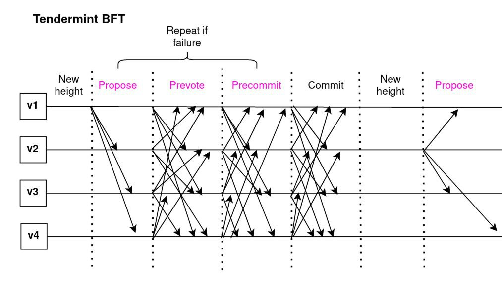

# Tendermint Core BFT

This article is intended to describe in brief main architectural peculiarities and code flow of the v0.37.0-rc2
[tendermint](https://github.com/tendermint/tendermint/tree/v0.37.0-rc2) (latest tag on 19 May 2023).

### Auxiliary

I would recommend to get familiar with 
[Tendermint Architectural Overview](https://docs.tendermint.com/v0.33/introduction/architecture.html)
for faster assimilation of subsequent information.

### Consensus

Main points of interest are _Reactor_ and _State_ components.

#### Key types:

* [vote](https://github.com/tendermint/tendermint/blob/v0.37.0-rc2/types/vote.go#L50)
* [proposal](https://github.com/tendermint/tendermint/blob/v0.37.0-rc2/types/proposal.go#L25)
* [events](https://github.com/tendermint/tendermint/blob/v0.37.0-rc2/types/events.go#L19)

#### Consensus Reactor

Tendermint uses several reactors for orchestration, 
based on the [reactor pattern](https://en.wikipedia.org/wiki/Reactor_pattern), including the consensus reactor.

[Receiving from peers](https://github.com/tendermint/tendermint/blob/v0.37.0-rc2/consensus/reactor.go#L226)

[Broadcasting to peers](https://github.com/tendermint/tendermint/blob/v0.37.0-rc2/consensus/reactor.go#L401)

#### State

State handles execution of the consensus algorithm.
It processes votes and proposals, and upon reaching agreement,
commits blocks to the chain and executes them against the application.

[Deciding block proposal](https://github.com/tendermint/tendermint/blob/v0.37.0-rc2/consensus/state.go#LL1129C28-L1129C28)

[Round state transition](https://github.com/tendermint/tendermint/blob/v0.37.0-rc2/consensus/state.go#L911)